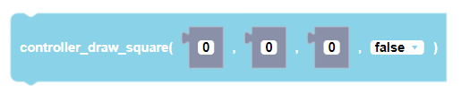
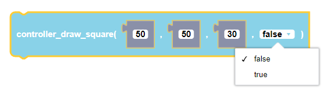

:::caution

This function is currently unavailable for CoDrone EDU (JROTC ed.).

:::

##### Block

<br />

##### Description
```
       width
        (x,y)|------|
             |      | width
             |______|
 ```       
draws a square on the controller screen starting from point (x,y) and will extend to the given width              

##### Parameters
 <br />
**xStart**: top left corner x coordinate <br />
**yStart**: top left corner y coordinate <br />
**width**: width of square <br />
**flagFill**: optional parameter to fill in the square or not. default value is False

##### Returns

None

##### Example


