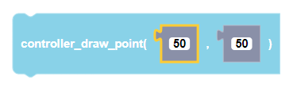

 
Plays a note for a specified amount of time in milliseconds using the CoDrone EDU.

##### Parameters
  
**x**: any integer (from 0 to +inifnity)  
**y**: any integer (from 0 to +inifnity)  

##### Returns

None

##### Example

