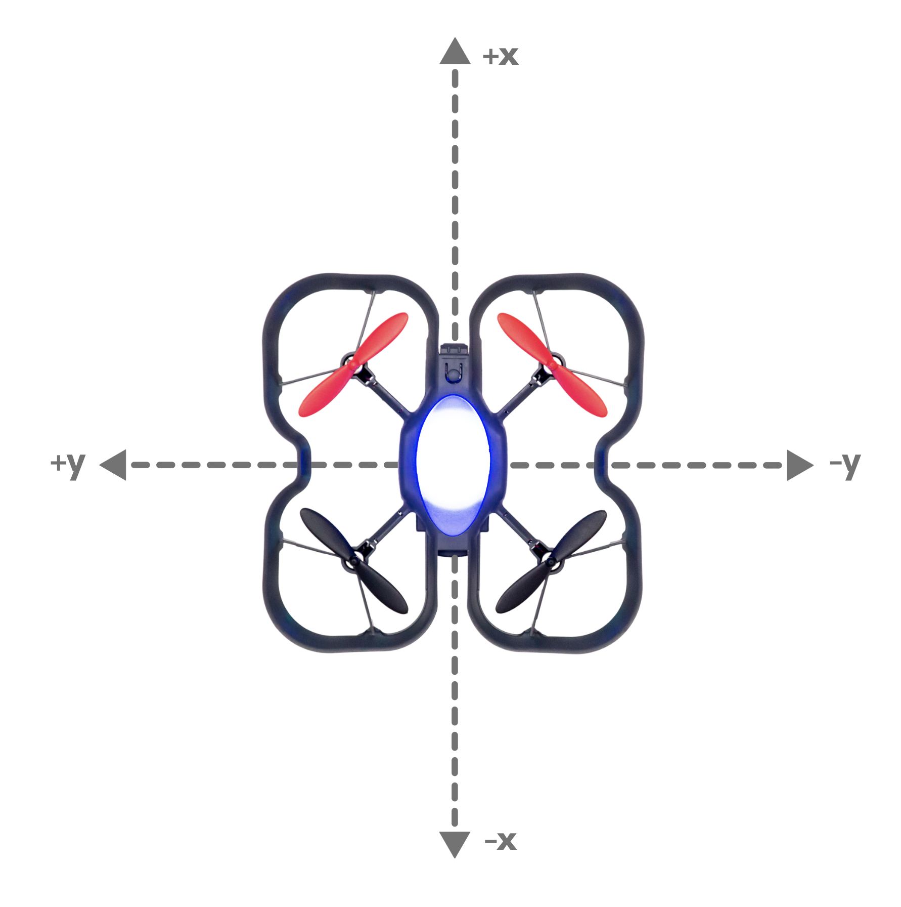
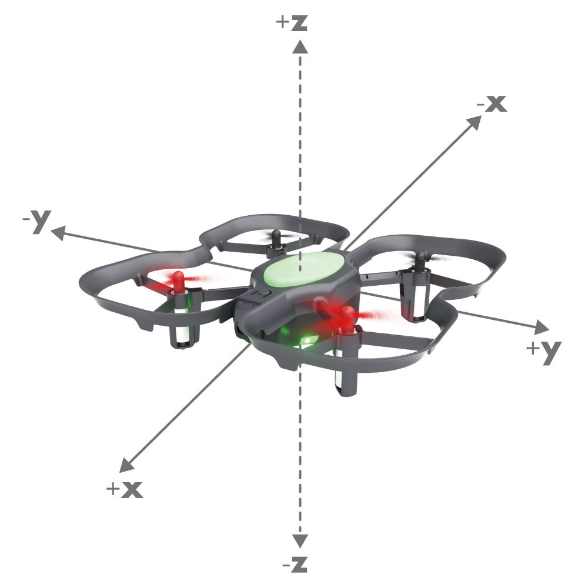

##### Description

Sends a movement command to the drone based on its absolute position from its takeoff location. Note: A sleep command for the length of the movement may be needed after using this movement command. <br />
The 'x' position of the drone is forwards and reverse. <br />
The 'y' position of the drone is left and right. <br />
The 'z' position of the drone is up and down. <br />
 <br />


##### Syntax
```send_absolute_position(positionX, positionY, positionZ, velocity, heading, rotationalVelocity)```

##### Parameters

**positionX**: Float value from -10 ~ 10 meters. The X position of the drone. Forward is positive. Backwards is negative.<br /> 
**positionY**: Float value from -10 ~ 10 meters. The Y position of the drone. Left is positive. Right is negative.<br /> 
**positionZ**: Float value from -10 ~ 10 meters. The Z position of the drone. Up is positive. Down is negative.<br /> 
**velocity**: Float value from 0.5 ~ 10 meters per second. The movement speed of the drone. <br /> 
**heading**:  Integer value from -360 - 360 degrees. Positive turns the drone left. Negative turns the drone right. <br /> 
**rotationalVelocity**: Integer value from 0 - 360 degrees per second. Left and right rotation speed of the drone.

##### Returns

None

##### Example Code
###### Python
```python
#Python code
from codrone_edu.drone import *

drone = Drone()
drone.pair()

drone.takeoff()

# Sending the drone forward from its takeoff location 0.5 meters moving at 0.5 m/s
drone.send_absolute_position(0.5, 0, 1, 0.5, 0, 0)
time.sleep(1) # Sleep command needed in order for this movement to execute.

# Sending the same command will cause the drone to hover around 
# the same area since this command uses absolute positioning from the takeoff location
drone.send_absolute_position(0.5, 0, 1, 0.5, 0, 0)
time.sleep(1)


drone.land()
```