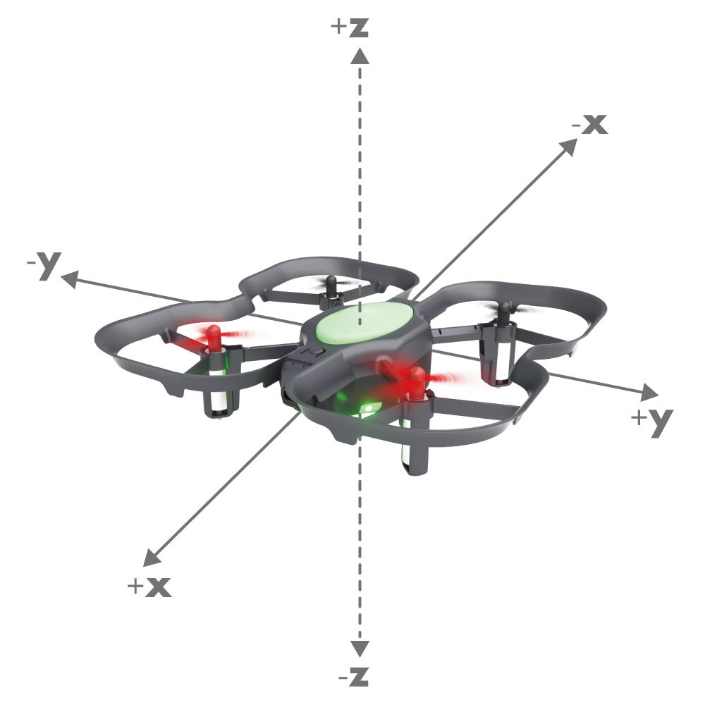

##### Description

Getter function that gets the z position of the drone. (z is up and down) <br />


##### Syntax
```get_pos_z()```<br />
```get_pos_z(unit="<cm, in, mm, m>)```<br />


##### Parameters
**unit**: The unit of measurement that is chosen for the position distance. Available units are "m" (meter), "cm" (centimeter), "mm" (millimeter), or "in" (inch). If a parameter is not specified cm is chosen by default.


##### Returns

The current z position of the drone.

##### Example Code
###### Python
```python
#Python code
from codrone_edu.drone import *

drone = Drone()
drone.pair()
try:
    drone.takeoff()
    print(drone.get_pos_z())
finally:
    drone.land()
    drone.emergency_stop()
    drone.close()
```