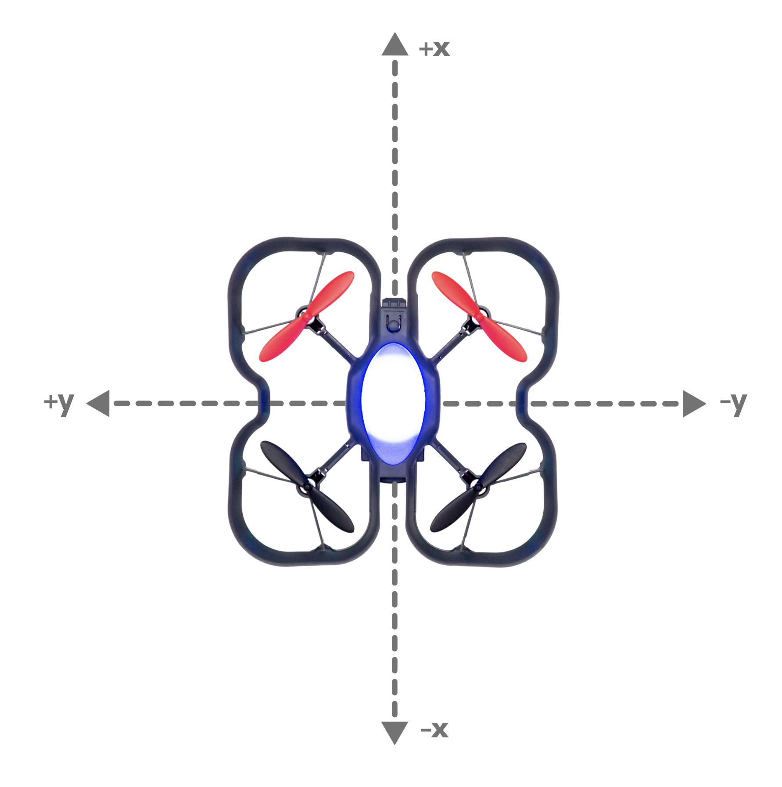

##### Description

Getter function that gets the x acceleration of the drone. (x is forwards and backwards) <br />


##### Syntax
```get_x_accel()```<br />


##### Parameters

None

##### Returns

The current x acceleration of the drone.

##### Example Code
###### Python
```python
#Python code
from codrone_edu.drone import *

drone = Drone()
drone.pair()
drone.takeoff()
print(drone.get_x_accel())
drone.land()
drone.close()
```