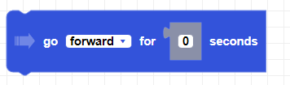

##### Block

##### Description

Moves the drone in a direction for a given duration.

##### Parameters

**direction**: forward, backward, up, down, left, right   
**duration**: positive integer in seconds

##### Returns

None

##### Example

