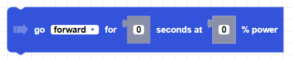
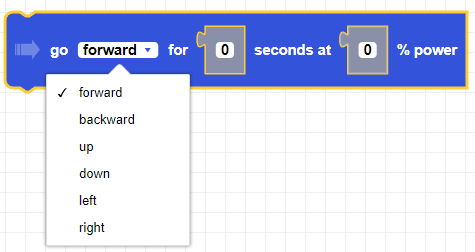
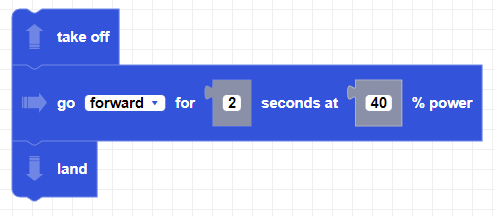

##### Block

##### Description
Moves the drone in a direction for a given duration and power percentage.

##### Parameters

**direction**: forward, backward, up, down, left, right   
**power**: Integer between 0 and 100   
**duration**: positive integer in seconds

##### Returns

None

##### Example

