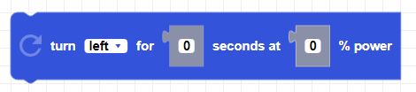
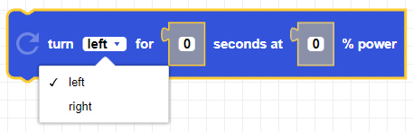
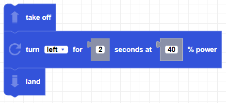

##### Block

##### Description

Turns the CoDrone Mini a in a given direction for the given duration at the given power percentage.

##### Parameters

**direction**: left, right   
**power**: positive integer between 0 and 100   
**duration**: positive integer in seconds

##### Returns

None

##### Example

