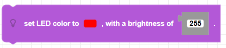
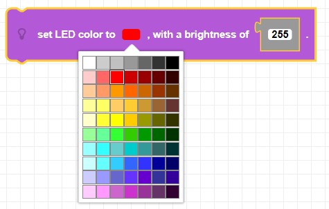
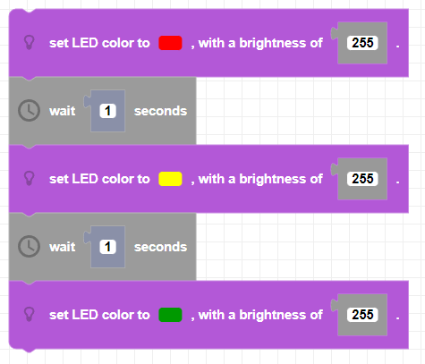

##### Block

##### Description

Sets the color of the CoDrone mini's LED.

##### Parameters

**color**: red, yellow, green, light blue, blue, purple, white, black  
**brightness**: Integer between 0 and 100   

##### Returns

None

##### Example

