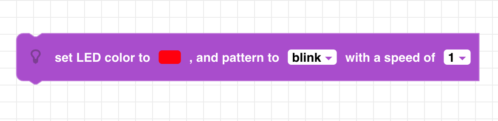
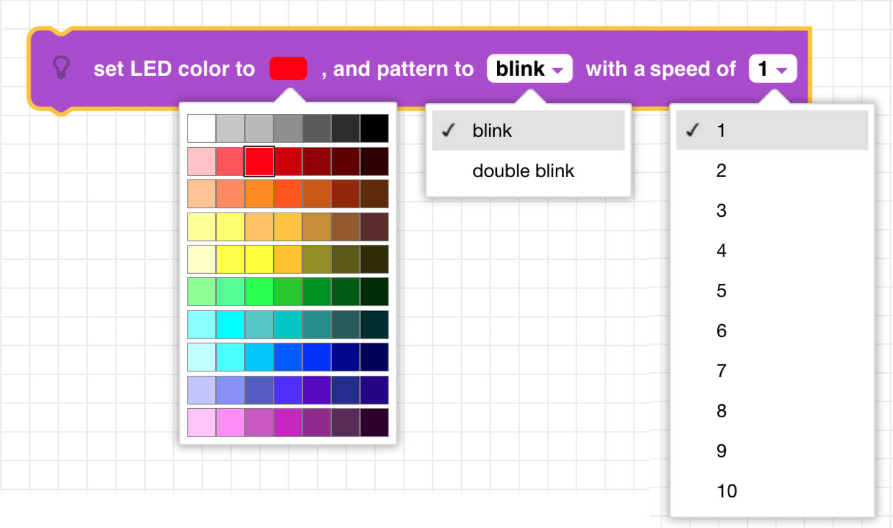
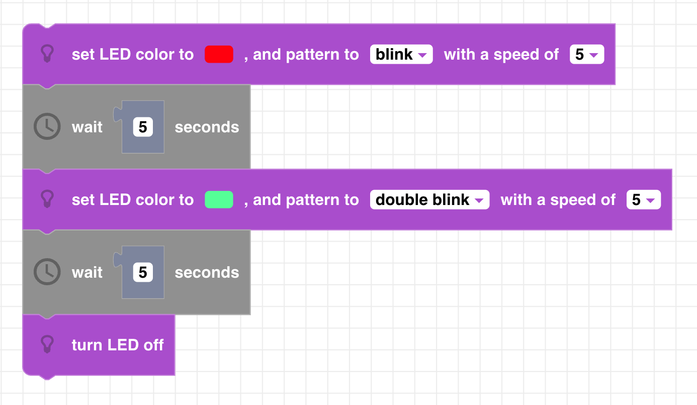

##### Block

##### Description

Sets the color of CoDrone Mini's LED to blinking pattern. "Blink" flashes the LED on and off and an interval determined by the speed parameter. "Double blink" flashes the LED twice before pausing at the interval determined by the speed parameter. 

##### Parameters

**color**: select a color from the color palette  
**pattern**: blink or double blink  
**speed**: Select a positive integer from 1 to 10   

##### Returns

None

##### Example

