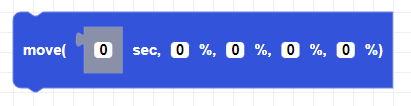
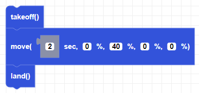

##### Block

##### Description

Moves the drone for a certain amount of time (in seconds) in a given direction determined by the flight parameters.

##### Parameters

**duration**: positive integer in seconds 
**roll**: roll power percentage as an integer between -100 and +100  
**pitch**: pitch power percentage as an integer between -100 and +100  
**yaw**: yaw power percentage as an integer between -100 and +100  
**throttle**: throttle power percentage as an integer between -100 and +100  

##### Returns

None

##### Example

