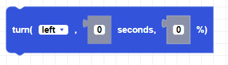
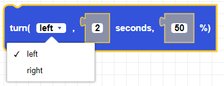
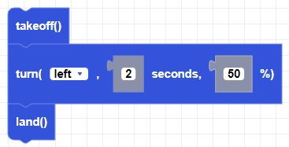

##### Block

##### Description

Turns the CoDrone mini a in a given direction for the given duration at the given power.

##### Parameters

**direction**: left, right   
**duration**: any positive integer in seconds  
**power**: Integer between -100 and 100   

##### Returns

None

##### Example

