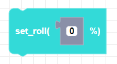
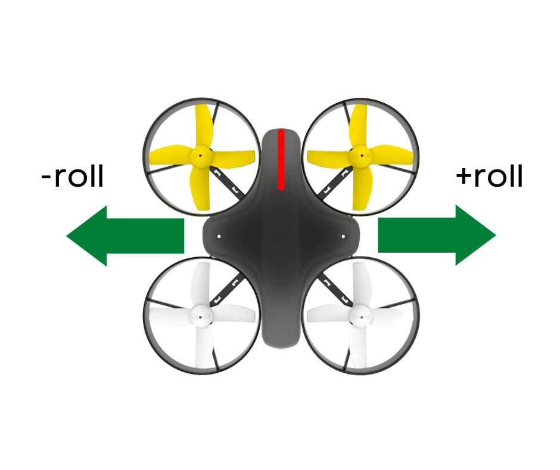
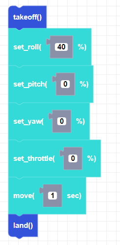

##### Block

##### Description

This function sets the roll direction variable but will not send a move command. Negative values will move the drone to the left and positive values will move the drone to the right.

##### Parameters
**power**: integer between -100 and 100   

##### Returns

None

##### Example

