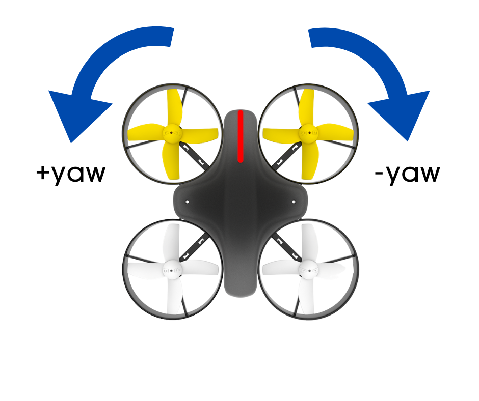
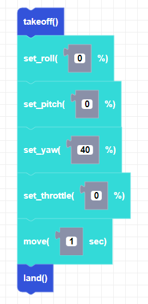

##### Block

##### Description

This function sets the yaw direction variable but will not send a move command. Negative values will turn the drone to the right and positive values will turn the drone to the left.

##### Parameters
**power**: integer between -100 and 100   

##### Returns

None

##### Example

