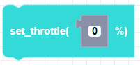
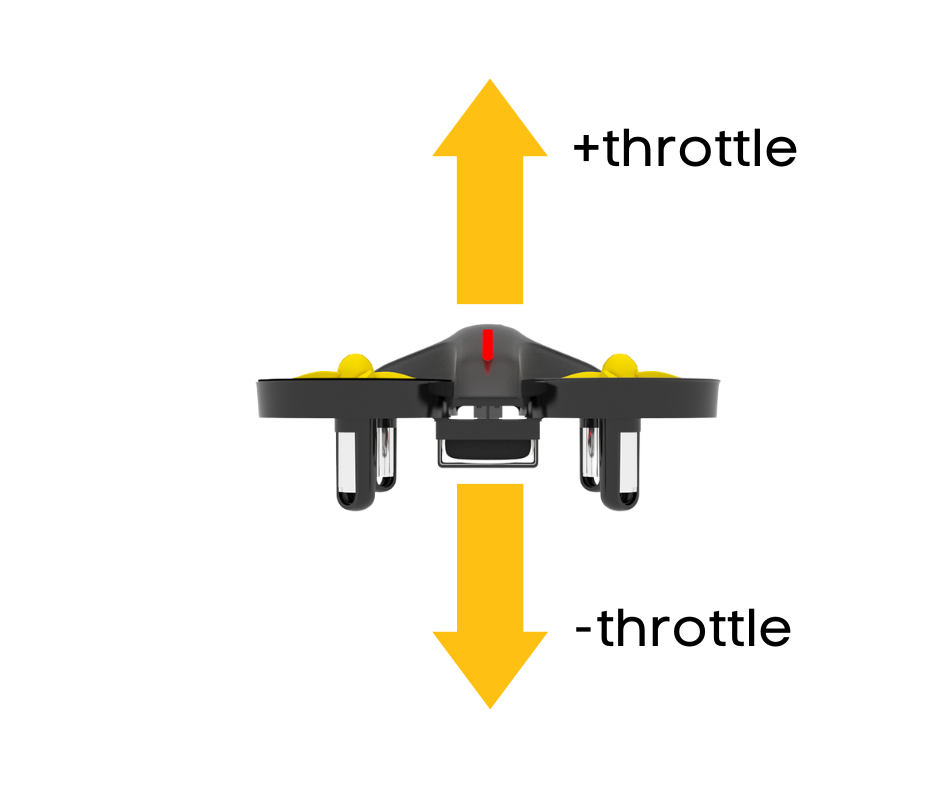

##### Block

##### Description

This function sets the throttle direction variable but will not send a move command. Negative values will move the drone downward and positive values will move the drone upward.

##### Parameters
**power**: integer between -100 and 100   

##### Returns

None

##### Example

