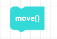
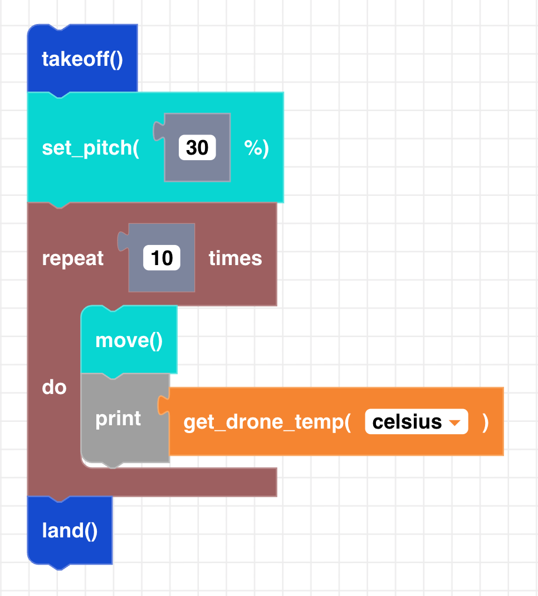

##### Block

##### Description

Moves the CoDrone mini for a specific duration of time after flight variables have been set. When using move with no parameter it will move the drone 0.1 seconds at a time. It's usually used inside of a loop to move the drone a certain number of 'steps'.

##### Parameters

None

##### Returns

None

##### Example

