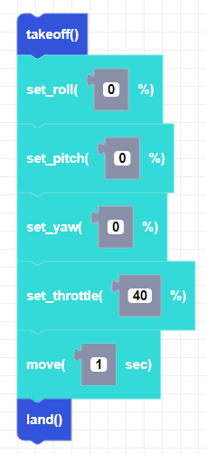

##### Block

##### Description

Moves CoDrone Mini for a duration in seconds in the direction set by the flight variables. 

##### Parameters

**duration**: positive integer in seconds   

##### Returns

None

##### Example

