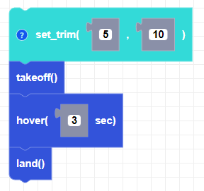

##### Block

##### Description

Sets the trim values of the CoDrone mini to adjust drifting.

##### Parameters
**roll**: Integer between -100 and 100   
**pitch**: Integer between -100 and 100   

##### Returns

None

##### Example

