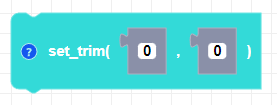

##### Block

##### Description

Sets the trim values to adjust for any drifting while CoDrone Mini is flying. Set the trim values in the opposite direction of drift. For example, if the drone is drifting to the right, set roll to a negative value. 

##### Parameters
**roll**: integer between -100 and 100   
**pitch**: integer between -100 and 100   

##### Returns

None

##### Example

