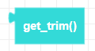

##### Block

##### Description

Returns the current trim values. Combine with a print statement to see the results printed to the console.

##### Parameters
 
None

##### Returns

**roll**: integer between -100 and 100   
**pitch**: integer between -100 and 100   

##### Example

