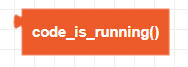
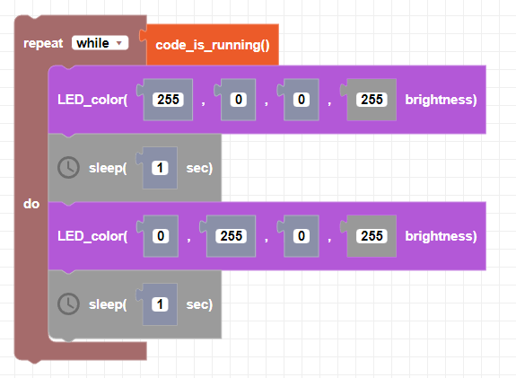

##### Block

##### Description

Returns a True value while your code is running. Use this block instead of "while True" when you want to run a "forever" loop. Use the "Stop" button in Blockly to stop the program.

##### Parameters

None

##### Returns

**Boolean**: returns true if program is running, false if user presses "Stop"

##### Example

