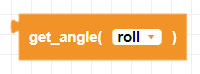
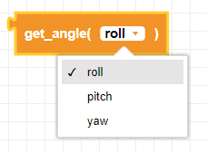
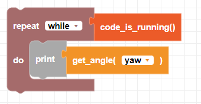

##### Block

##### Description

This function returns the **roll, pitch, and yaw angles** from the gyroscope. The 0 angle is set when pairing.

##### Parameters

**axis**: select roll, pitch or yaw

##### Returns

**angle**: integer in degrees from the starting position

##### Example
For this example, manually turn your drone by hand to see the yaw angle change.

