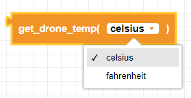
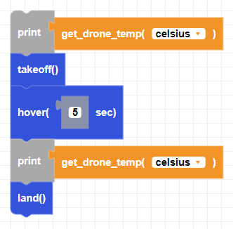

##### Block

##### Description

This block returns the current temperature of the drone in either Celsius or Fahrenheit.

##### Parameters

##### Returns

**temperature**: float value in either Celsius or Fahrenheit

##### Example

