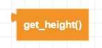
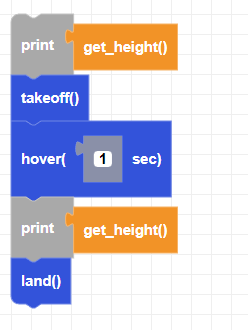

##### Block

##### Description

This is a getter function which returns the current **height** of the drone.  
It checks sea level from the barometer sensor first and then the altitude from the floor right after it is paired. This function returns the distance between the drone's current position and the floor or any surface below from where it took off from.  

##### Parameters

None

##### Returns

The current height calculated by the difference between the current and the floor altitude(cm).

##### Example

