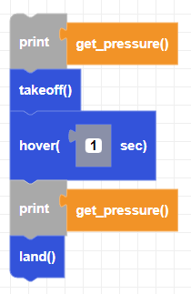

##### Block

##### Description

This function return barometer data in Pascals.   
**Note:** 1atm = 101325 Pa

##### Parameters

None

##### Returns

**pressure**: float value in Pascals

##### Example

