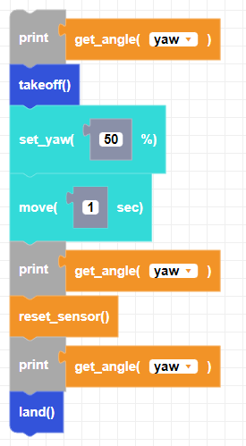

##### Block

##### Description

Resets the gyroscope angles to 0. The drone will flash while the gyroscope is recalibrating. Do not handle or move the drone during calibration.

##### Parameters

None

##### Returns

None

##### Example

Rotate the drone with your hand on a flat surface. See the angles change by observing the printed values in the console. Stop moving the drone when the screen prints "resetting". After resetting, the gyroscope angles will return to 0. 

