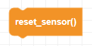

##### Block

##### Description

Resets the gyroscope angles to 0. The drone will flash while the gyroscope is recalibrating. Do not handle or move the drone during calibration.

##### Parameters

None

##### Returns

None

##### Example

