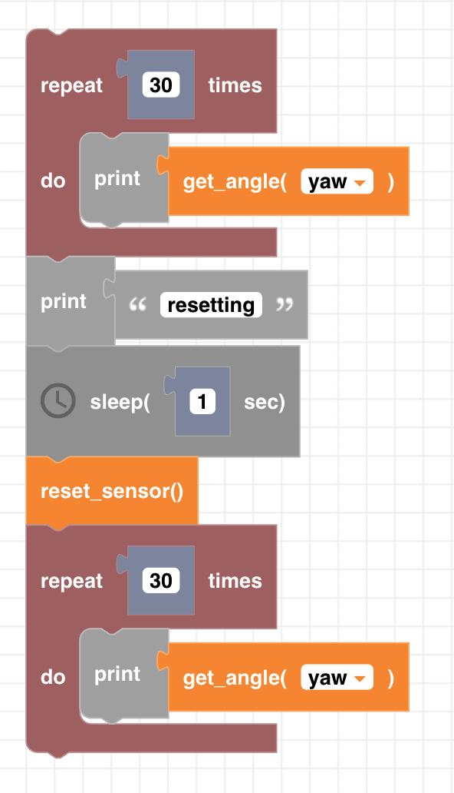

##### Block

##### Description

Resets the gyroscope angles to 0. The drone will flash while the gyroscope is recalibrating. Once the light stops flashing the calibration is complete

##### Parameters

None

##### Returns

None

##### Example

