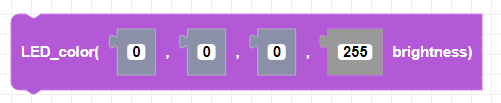
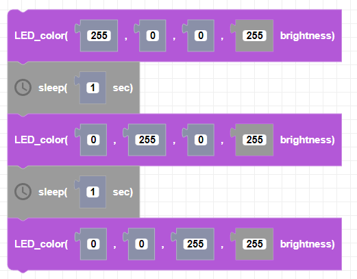

##### Block

##### Description

Sets the color of the CoDrone mini's LED.

##### Parameters
**red**: Integer between 0 and 255   
**green**: Integer between 0 and 255   
**blue**: Integer between 0 and 255   
**brightness**: Integer between 0 and 255   

##### Returns

None

##### Example

