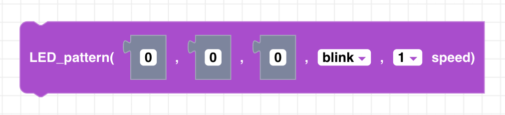
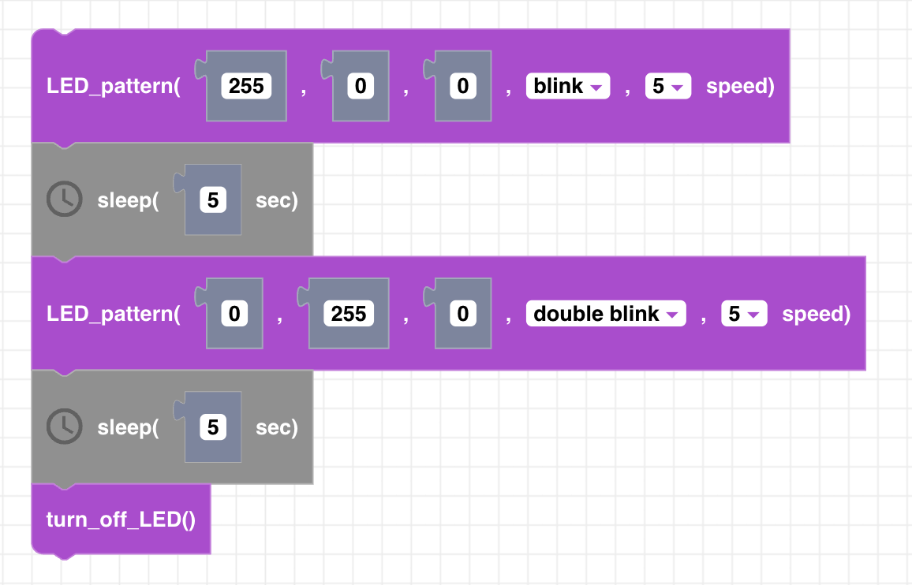

##### Block

##### Description

Sets the color of CoDrone Mini's LED blinking pattern. "Blink" flashes the LED on and off and an interval determined by the speed parameter. "Double blink" flashes the LED twice before pausing at the interval determined by the speed parameter. 

##### Parameters
**red**: positive integer between 0 and 255   
**green**: positive integer between 0 and 255   
**blue**: positive integer between 0 and 255   
**pattern**: blink or double blink  
**speed**: select a positive integer from 1 to 10   

##### Returns

None

##### Example

