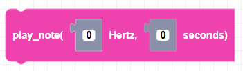
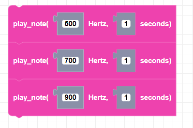

##### Block

##### Description

Plays a note for a specified amount of time using the CoDrone mini.

##### Parameters
**hertz**: The frequency in Hertz of the sound. Integer value.  
**duration**: duration of the note in seconds. any positive integer

##### Returns

None

##### Example

