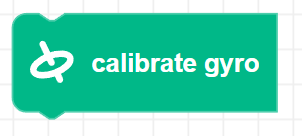

##### Block

##### Description

Recalibrates Zumi's gyroscope. This should only be used if the gyroscope is giving inaccurate results.  
Zumi needs to be on a flat surface and should not be moved while recalibrating the gyroscope.

##### Parameters

None

##### Returns

None

##### Example

