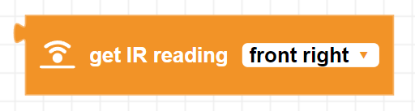
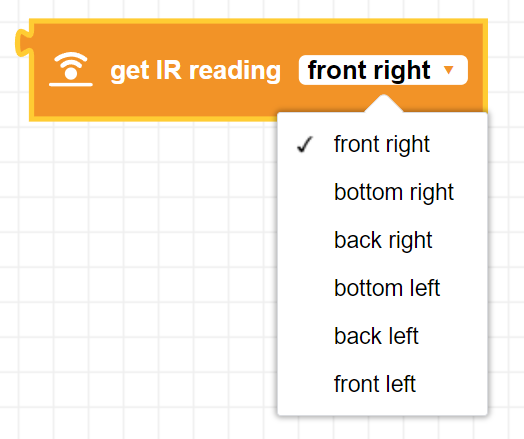
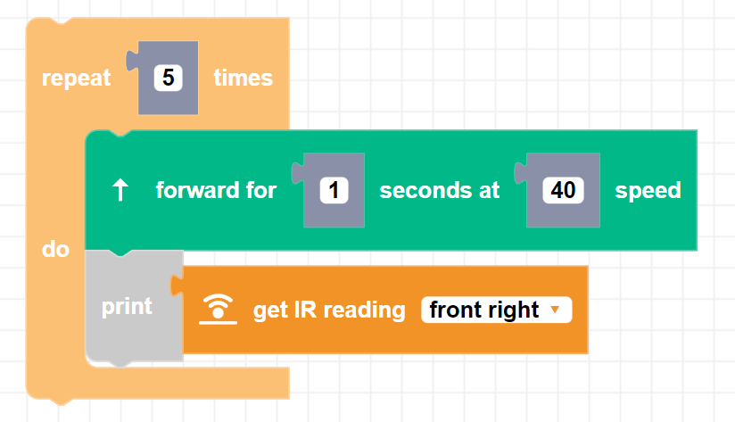

##### Block

##### Description

Get's the current IR reading from Zumi's sensors. This reading tells how far away an object is from the chosen sensor.

##### Parameters

##### Returns

None

##### Example

