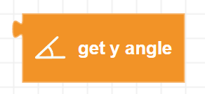
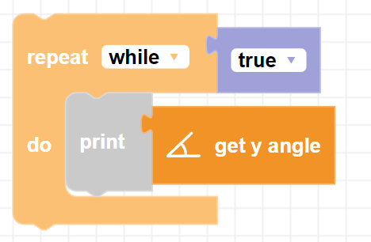

##### Block

##### Description

Gets the current Y angle from Zumi's gyroscope

##### Parameters

None <!-- image -->

##### Returns

None

##### Example

With this example, tilt Zumi with your hands to see the Y angle change!

