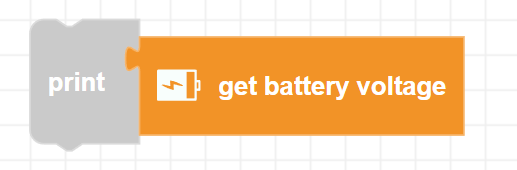

##### Block

##### Description

Gets the current voltage from Zumi's battery. It typically varies from 3.45V-4.14V when not connected over USB. If connected over USB, this function may return 1.7V or below.

##### Parameters

None 

##### Returns

**voltage**: A float value in units of Volts

##### Example

