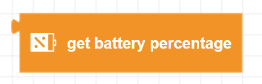
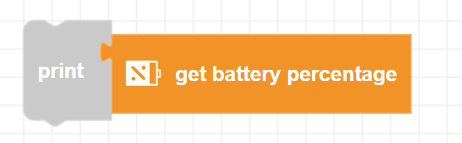

##### Block

##### Description

Gets the current battery percentage from Zumi's battery when not connected over USB power. The percentage will vary while driving since it is dependent on battery voltage.

##### Parameters

None 

##### Returns

**percentt**: An integer value from 0 to 100

##### Example

