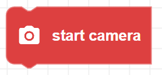

##### Block

##### Description

Turns on Zumi's camera. A red LED will turn on next to the camera to indicate the camera is on. The camera needs to turn on before taking any pictures and will stay on until it is manually turned off with the close_camera() block.

##### Parameters

None 

##### Returns

None

##### Example

