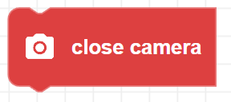

##### Block

##### Description

Turns off Zumi's camera. It is recommended to always turn off the camera when not in use to conserve battery. The camera cannot be started again unless the camera is already off.

##### Parameters

None 

##### Returns

None

##### Example

