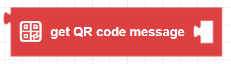
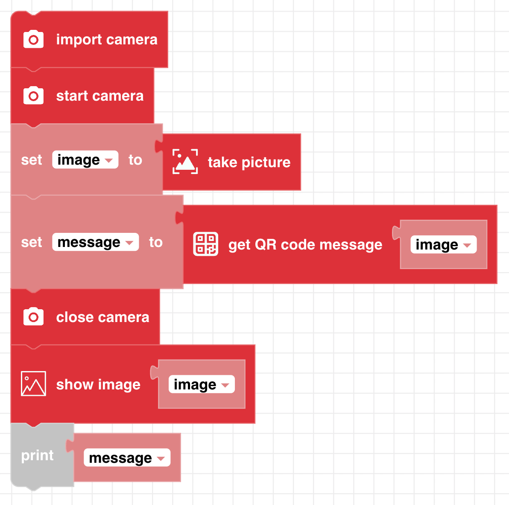

##### Block



##### Description

Searches an image for a QR code message. If a QR code was found, the encoded message is saved to a string.

##### Parameters

**image**: A frame object composed of an array of pixels.

##### Returns

**string**: A string containing the message of the QR code. Returns ```None``` if no QR code was detected.

##### Example


