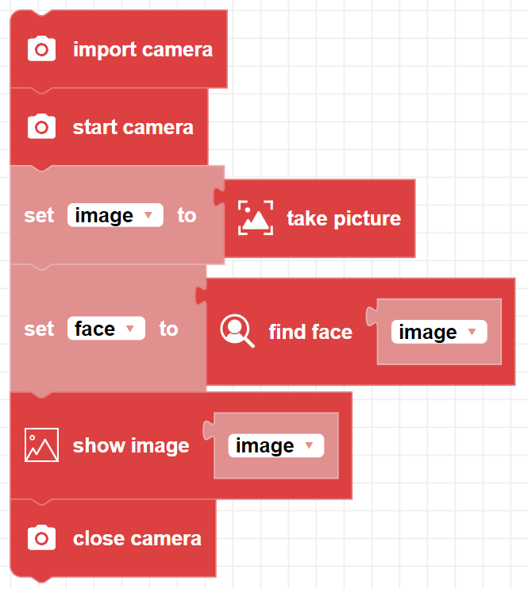

##### Block

##### Description

Searches an image for a face. Returns True if a face was detected

##### Parameters

**image**: A frame object composed of an array of pixels.

##### Returns

**boolean**: Returns True if a face was detected. Otherwise, returns False.

##### Example

