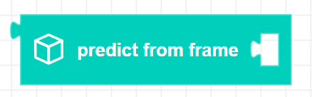
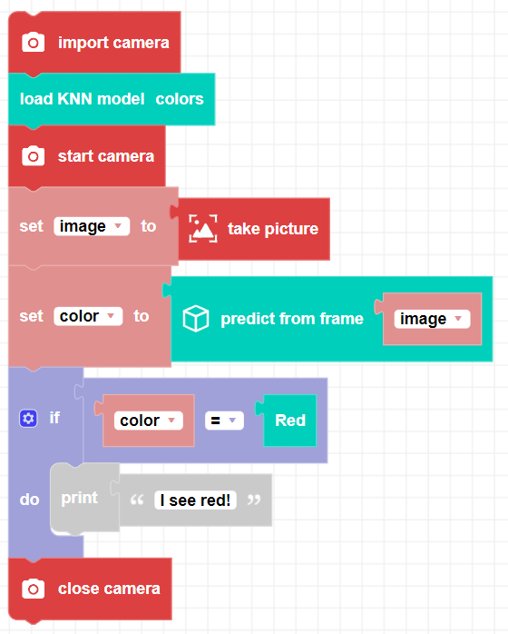

##### Block

##### Description

Predicts a label from an image based on a previously trained color model. A KNN color model needs to be trained and loaded into the program to use predict_from_frame(). 

##### Parameters

**image**: A frame object composed of an array of pixels.

##### Returns

**string**: A string containing the predicted label.

##### Example

