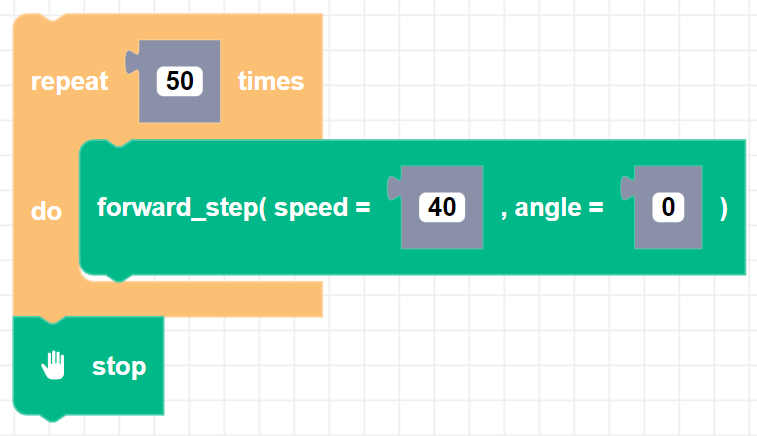

##### Block

##### Description

Takes one drive "step" at a time moving Zumi forward. This block must be used in a loop and a stop block must be used to stop Zumi.

##### Parameters

**speed**: Drive speed between 0 and 127; must be below the max_speed   
**angle**: Heading (0 degrees is defined when the Zumi object is created.)

##### Returns

None

##### Example

