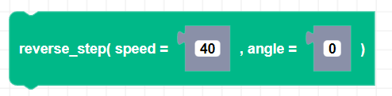
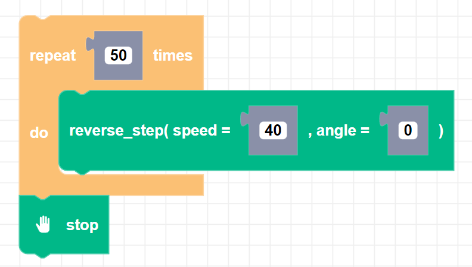

##### Block

##### Description

Takes one drive "step" backward in the direction of the angle heading. This block must be used in a loop to observe any movement. Use the stop block at the end of the for loop to stop Zumi.

##### Parameters

**speed**: An integer from 0 to 127  
**angle**: An integer in degrees (0 degrees is defined when the Zumi object is created)

##### Returns

None

##### Example

