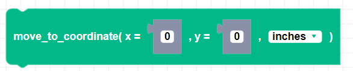
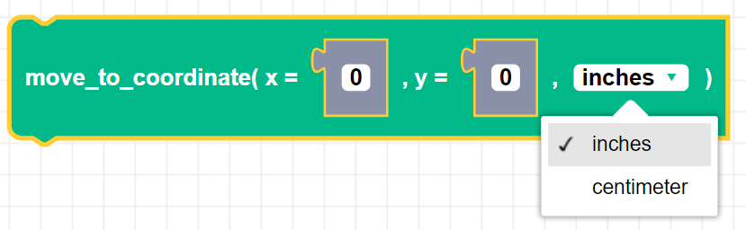
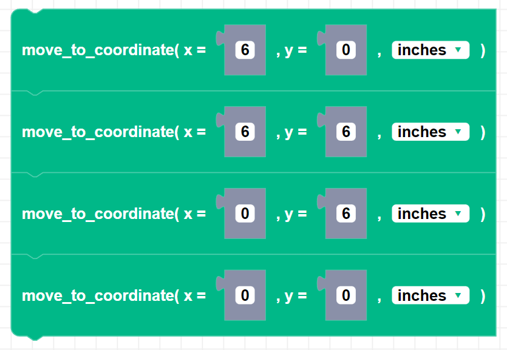

##### Block

##### Description

This method drives Zumi from an origin to an x,y position in inches. Using this function will keep track of Zumi's coordinates. To reset the origin, use the reset_coordinate() function. This method uses a best fit linear approximation of the distance traveled over time. It uses the equation y = mx + b, where:
* y is the distance traveled
* m is the predicted speed in centimeters per second
* x is the time elapsed
* b is the slope intercept

##### Parameters

**x**: The x coordinate of the movement.   
**y**: The y coordinate of the movement.   
**unit**: The distance of x and y coordinates can be in inches or centimeters.

##### Returns

None

##### Example

