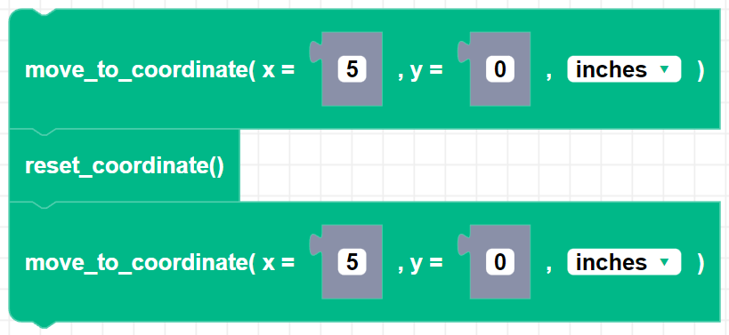

##### Block


##### Description

Resets Zumi's coordinates to (0,0). The origin will be reference point when using the ```move_to_coordinate()``` block.

##### Parameters

None 

##### Returns

None

##### Example

In this example, Zumi moves 5 inches in the x-direction. After resetting the coordinates Zumi will move another 5 inches in the x-direction since the origin has been reset.

