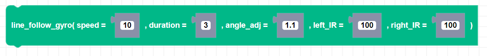

##### Block

##### Description

Uses the bottom IR sensors so that Zumi can execute a line following program for the duration of the timeout. If the bottom IR sensors detect a black line, Zumi will continue to drive forward. If one of the sensors detects white, Zumi will turn left or right to stay on the line. If both sensors detect white, Zumi will automatically stop, regardless of the timeout.The speed is capped to 80.

##### Parameters

**speed**: Positive integer value for speed between 0 and 80   
**duration**: Float value timeout in seconds   
**angle_adj**: Integer number of degrees Zumi will turn if one IR sensor detects white. 
**left_IR**: Integer threshold of the bottom left IR sensor.   
**right_IR**: Integer threshold of the bottom right IR sensor.   

##### Returns

None

##### Example

