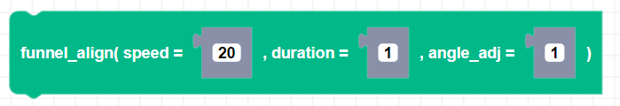
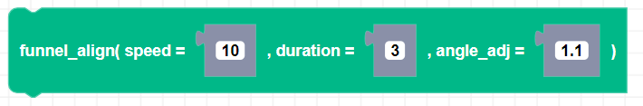

##### Block

##### Description

Uses the bottom IR sensors so that Zumi can align to the funnel piece on the competition field for the duration of the timeout (Click [here](https://learn.robolink.com/wp-content/uploads/2021/06/current_funnel.pdf) for a PDF version of the funnel piece).

##### Parameters

**speed**: Positive integer value for speed between 0 and 80   
**duration**: Float timeout value in seconds  
**angle_adj**: Integer number of degrees Zumi will turn if one IR sensor detects white.

##### Returns

None

##### Example

