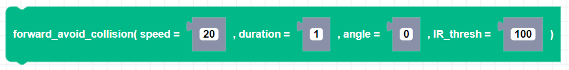

##### Block

##### Description

Drives Zumi forward until an object is detected or the timeout runs out, whicever comes first. An object is considered detected if either of the front IR sensor values goes below the threshold.

##### Parameters

**speed**: Positive integer value for speed between 0 and 80   
**duration**: Float value timeout in seconds   
**angle**: Integer heading in degrees (Default to None which is Zumi's current heading)
**IR_thresh**: Integer threshold of front IR sensors.   

##### Returns

None

##### Example

