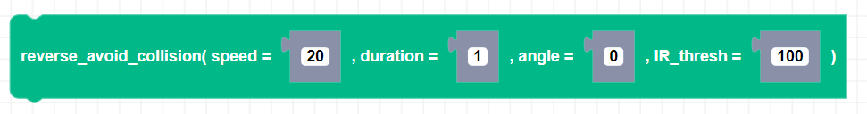

##### Block

##### Description

Drives Zumi in reverse at a default speed of 20 for 1 second in the direction Zumi is currently facing. If either of the front IR sensor values go below the threshold, Zumi will stop even if the duration or timeout is not complete.

##### Parameters

**speed**: Positive integer value for speed between 0 and 80   
**duration**: Number of seconds Zumi will drive and check for collision   
**angle**: Heading or desired angle (Default to None which is Zumi's current heading)
**IR_thresh**: threshold of front IR sensors.   

##### Returns

None

##### Example

