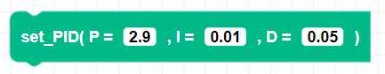

##### Block

##### Description

Sets the proportional, integral and derivative terms in a PID control system. These parameters help Zumi drive straight and make accurate turns. The default values are recommended, but can be adjusted to see how the control system works.

Proportional: the output is proportional to the error
Integral: compensates for the sums of the error over time
Derivative: compensates for sudden changes in the error

##### Parameters

**P**: float value for proportional control  
**I**: float value for integral control  
**D**: float value for derivative control  
##### Returns

None

##### Example

